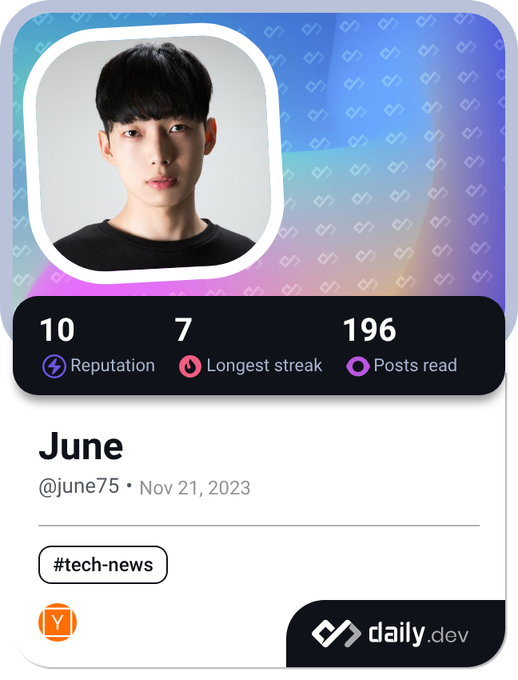

<!-- ── HERO ─────────────────────────────────────────────── -->
<picture>
  <source media="(prefers-color-scheme: light)" srcset="./assets/hero-light.svg">
  
</picture>

  

 

## <samp>$ whoami</samp>

> **"문제를 만나면 일단 반갑습니다."** 🧐

백엔드가 본진인 개발자 **준수한쭌**입니다. Java · Spring · Kotlin으로 서버를 만들고, 요즘은 문제 해결 도구 자체를 만드는 재미에 빠져 있습니다.

- 🔭 **요즘 하는 것** — MCP 서버(`chacha-mcp`), 레거시 UI 수정 보조 도구(`assistant-ui`) 같은 AI 도구 만들기
- 🌱 **배우는 것** — Kotlin 기반 백엔드, Spring Batch(`killbatch`), TypeScript & React
- 🎥 **해본 것** — AWS Rekognition 영상 분석 백엔드, 실시간 영상 비전 분석 파이프라인
- ✍️ **기록하는 곳** — [준수한쭈니네](https://jjunii486.tistory.com/) (불친절한 쓸데없는 나만의 블뤄그 입니돠)

 

<!--
  📝 blog section — 티스토리 RSS 연동 준비 중 (추후 활성화)
  활성화 방법: 아래 주석을 풀고 마커를 HTML 주석 형태(<!── BLOG-POST-LIST:START ──>)로 되돌린 뒤,
  .github/workflows/blog-posts.yml 의 schedule/push 트리거를 복구하면 됩니다.

## <samp>$ tail -f blog.log</samp>

BLOG-POST-LIST:START
BLOG-POST-LIST:END

🕛 12시간마다 <a href="https://jjunii486.tistory.com/">준수한쭈니네</a>에서 자동으로 가져옵니다

-->

## <samp>$ ping june</samp>

매일 읽고, 매일 기록합니다.

  

🐍 어제의 커밋은 오늘의 뱀이 먹습니다

<picture>
  <source media="(prefers-color-scheme: dark)" srcset="https://raw.githubusercontent.com/blackjune67/blackjune67/output/github-snake-dark.svg">
  
</picture>

  

<picture>
  <source media="(prefers-color-scheme: light)" srcset="./assets/footer-light.svg">
  
</picture>

