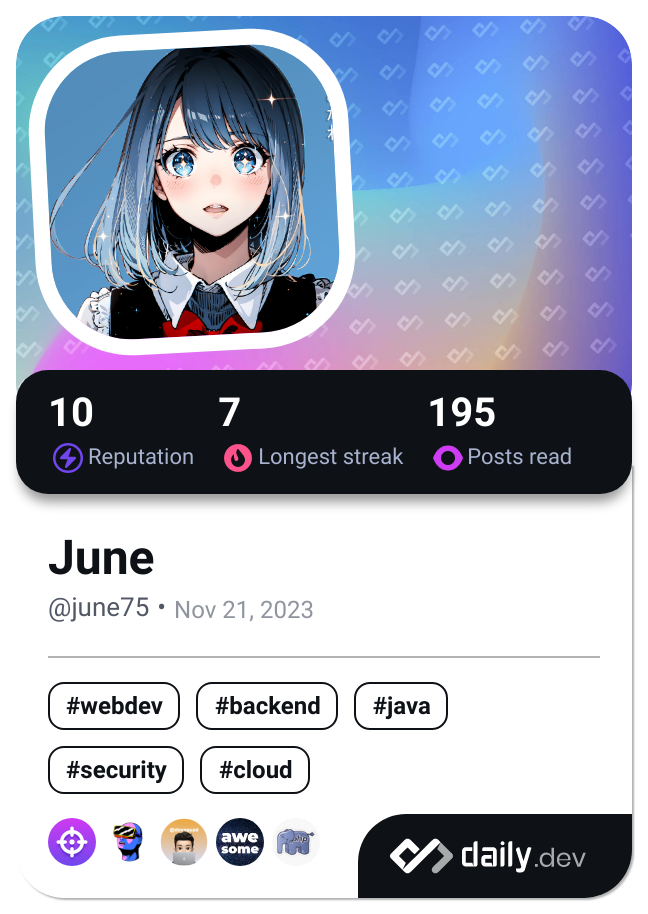

  

<!--  -->

 

🙌 Introduction
===
Hi, I am trying to become a nice developer 😎

 

### :blue_book: Blog
<a href="https://jjunii486.tistory.com/" target="_blank">

 

###  :clipboard: Skill
<!-- BackEnd -->
  

<!-- FrontEnd -->
   

<!-- DB -->
  

<!-- CI/CD -->
<!--  -->

<!-- IDE -->
 

<!-- UTILL -->
 

 
<!-- 
### :pencil2: Study

-->

<!--
Here are some ideas to get you started:
- 🔭 I’m currently working on ...
- 🌱 I’m currently learning ...
- 👯 I’m looking to collaborate on ...
- 🤔 I’m looking for help with ...
- 💬 Ask me about ...
- 📫 How to reach me: ...
- 😄 Pronouns: ...
- ⚡ Fun fact: ...
-->

<!-- 

--> 

<!--

-->
